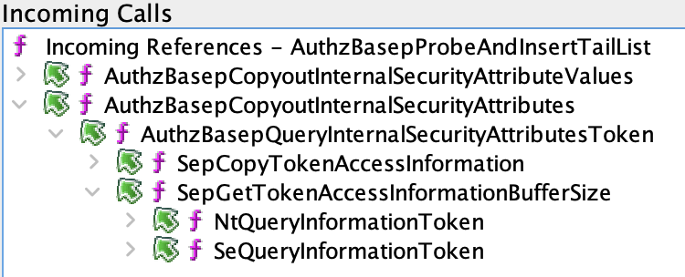

June 2024 had 4 CVEs in the Windows Kernel, all being EoPs:
- [CVE-2024-30064](https://msrc.microsoft.com/update-guide/vulnerability/CVE-2024-30064)
- [CVE-2024-30068](https://msrc.microsoft.com/update-guide/vulnerability/CVE-2024-30068)
- [CVE-2024-30088](https://msrc.microsoft.com/update-guide/vulnerability/CVE-2024-30088)
- [CVE-2024-30099](https://msrc.microsoft.com/update-guide/vulnerability/CVE-2024-30099)

For this diff, I used the new `ntoskrnl.exe` [KB5039212](https://msdl.microsoft.com/download/symbols/ntoskrnl.exe/3F260E721047000/ntoskrnl.exe) & the old `ntoskrnl.exe` [KB5037853](https://msdl.microsoft.com/download/symbols/ntoskrnl.exe/CE6B5AD21047000/ntoskrnl.exe), which are the Windows 11 22H2 and 23H2 kernels. Since all 4 of these vulnerabilities were discovered by different people/groups, its expected that they will likely be in distinct attack surfaces.


From looking at the diff, there are 3 new feature flags:
-  [Feature_1875039550__private_IsEnabledDeviceUsage](#feature_1875039550__private_isenableddeviceusage)
* [Feature_1875039550__private_IsEnabledFallback](#feature_1875039550__private_isenabledfallback)
* [Feature_2516935995__private_IsEnabledDeviceUsage](#feature_2516935995__private_isenableddeviceusage)
* [Feature_2516935995__private_IsEnabledFallback](#feature_2516935995__private_isenabledfallback)
* [Feature_3391791421__private_IsEnabledDeviceUsage](#feature_3391791421__private_isenableddeviceusage)
* [Feature_3391791421__private_IsEnabledFallback](#feature_3391791421__private_isenabledfallback)


The following functions were modified:
* [AuthzBasepCopyoutInternalSecurityAttributes](#authzbasepcopyoutinternalsecurityattributes)
* [AuthzBasepCopyoutInternalSecurityAttributeValues](#authzbasepcopyoutinternalsecurityattributevalues)
* [HalpAcpiInitSystem](#halpacpiinitsystem)
* [LdrResSearchResource](#ldrressearchresource)
* [LdrpResGetMappingSize](#ldrpresgetmappingsize)
* [NtSetInformationWorkerFactory](#ntsetinformationworkerfactory)

At this point, we can conclude that its likely that these are the 4 components with the 4 vulnerabilities in them: Authz, HAL, the PE Loader and the NtSetInformationWorkerFactory system call.

Lets look at the `Authz` changes first

# Authz Bugs

Not too far into the diff for `AuthzBasepCopyoutInternalSecurityAttributes`, we see the following addtion:
```diff
+          uVar10 = Feature_
__private_IsEnabledDeviceUsage();
+          if ((int)uVar10 == 0) {
+            ppuVar6 = *(ulonglong ***)param_2[1];
+            if (*ppuVar6 != puVar1) {
+              pcVar7 = (code *)swi(0x29);
+              (*pcVar7)(3);
+              goto LAB_0;
+            }
+            puVar3 = (ulonglong *)(plVar12 + -0xd);
+            plVar12[-0xc] = (longlong)ppuVar6;
+            *puVar3 = (ulonglong)puVar1;
+            *ppuVar6 = puVar3;
+            *(ulonglong **)param_2[1] = puVar3;
+          }
+          else {
+            uVar9 = AuthzBasepProbeAndInsertTailList
+                              ((ulonglong)puVar1,(ulonglong *)(plVar12 + -0xd),_Size,param_4);
+            uVar10 = uVar9 & 0xffffffff;
+            if ((int)uVar9 < 0) goto LAB_1;
+          }
```

Microsoft is gating this change behind the `Feature_2516935995`. The addition of the `AuthzBasepProbeAndInsertTailList` function, seems to indicate that the vulnerability is a lack of probing for some user supplied parameter. Let's look at the new function:
```C
undefined8
AuthzBasepProbeAndInsertTailList
          (ulonglong param_1,ulonglong *param_2,undefined8 param_3,ulonglong param_4)

{
  ulonglong **ppuVar1;
  
  ppuVar1 = *(ulonglong ***)(param_1 + 8);
  if (param_1 < 0x7fffffff0000) {
    ProbeForWrite((undefined *)ppuVar1,0x10,4,param_4);
  }
  *param_2 = param_1;
  param_2[1] = (ulonglong)ppuVar1;
  *ppuVar1 = param_2;
  *(ulonglong **)(param_1 + 8) = param_2;
  return 0;
}
```

From the comparison statement, it looks like there was a failure to call `ProbeForWrite` on `param_1`, which correlates to `puVar1` in `AuthzBasepCopyoutInternalSecurityAttributes`.  

Now, to determine where this attack surface is, we can check the Ghidra call tree:


From this, we can see that the vulnerable code is reachable from `NtQueryInformationToken`. We can also see that the call to `AuthzBasepCopyoutInternalSecurityAttributeValues` was likely also vulnerable. That being said, `AuthzBasepCopyoutInternalSecurityAttributeValues` is only ever called from within `AuthzBasepCopyoutInternalSecurityAttributes` so I don't think it really warrants a distinct CVE.

## Another Bug?
On my second pass, I noticed there were more feature flags used within this function:
```diff
+          uVar9 = Feature_3391791421__private_IsEnabledDeviceUsage();
+          if ((int)uVar9 == 0) {
+            *(short *)((longlong)plVar12 + -0x46) = (short)local_res20;
+            *(undefined2 *)(plVar12 + -9) = 0;
+            plVar12[-8] = uVar10;
+            RtlCopyUnicodeString((ushort *)(plVar12 + -9),(ushort *)(pplVar13 + 4));
+          }
+          else {
+            _auStack_4c = SUB1612(ZEXT816(0),4);
+            auVar8._2_12_ = _auStack_4c;
+            auVar8._0_2_ = (short)local_res20;
+            _local_50 = auVar8._0_8_ << 0x10;
+            uStack_48 = uVar10;
+            RtlCopyUnicodeString((ushort *)local_50,(ushort *)(pplVar13 + 4));
+            *(undefined (*) [4])(plVar12 + -9) = local_50;
+            *(undefined (*) [4])((longlong)plVar12 + -0x44) = auStack_4c;
+            *(undefined4 *)(plVar12 + -8) = (undefined4)uStack_48;
+            *(undefined4 *)((longlong)plVar12 + -0x3c) = uStack_48._4_4_;
+          }
```
#todo Finish this line of research
# LdrResSearchResource

Within `LdrResSearchResource`, the following change was immediately noticeable:
```diff
-  if (((uVar1 & 0xfff80000) != 0) || (((param_3 < 3 && ((uVar1 & 2) == 0)) || (4 < param_3))))
-  goto LAB_0;
+  uVar7 = Feature_1875039550__private_IsEnabledDeviceUsage();
+  if ((int)uVar7 == 0) {
+    uVar4 = uVar1 & 0xfff80000;
+  }
+  else {
+    uVar4 = uVar1 & 0xfff00000;
+  }
+  if ((uVar4 != 0) || (((param_3 < 3 && ((uVar1 & 2) == 0)) || (4 < param_3)))) goto LAB_0;
```
Again, we have a change gated by a feature flag, this time `Feature_1875039550`. This bug isn't immediately obvious, but we know it has something to do with flags based off of the differing paths taken dependent upon the feature flag. In the patch, `0x8000` is removed from the boolean and statement. Now we just have to determine what the flag actually is. 

If we take a step back for a moment, there was another changed `Ldr` function, `LdrpResGetMappingSize`. It too checks the `Feature_1875039550` flag.

Looking at this function:
```C
  uVar7 = 0;
  FeatureFlag = Feature_1875039550__private_IsEnabledDeviceUsage();
  if (((int)FeatureFlag == 0) || ((param_3 >> 0x13 & 1) == 0)) {
    if ((param_3 >> 0x11 & 1) != 0) {
      uVar7 = *param_2;
    }
```

`param_3` in this case is the flag we are passing in to this function. Since `LdrpResGetMappingSize` is invoked by `LdrResSearchResource`, we can follow the feature flag across function calls. It also turns out that `((param_3 >> 0x13 & 1) == 0))` is precisely the bitfield  the feature flag in `LdrResSearchResource` is checking for. 


This check in `LdrpResGetMappingSize` is explicitly making sure that the bit in the flag is NOT set, whereas in the parent function, the changes are making it so that we don't care particularly about the value of this bit. This means that there must have been a decision made in the buggy code based upon the presence of this field, leading to some for of broken assumption in the loader. In the case where this bit is set, the new code will skip a whole bunch of logic involving parsing the PE image header, DATA_TABLE_ENTRYs, and invoking `ZwQueryVirtualMemory`.

#todo Figure out what the actual bug is here. Will probably involve crafting special PE files to test. I'm not certain exactly what this flag is yet...